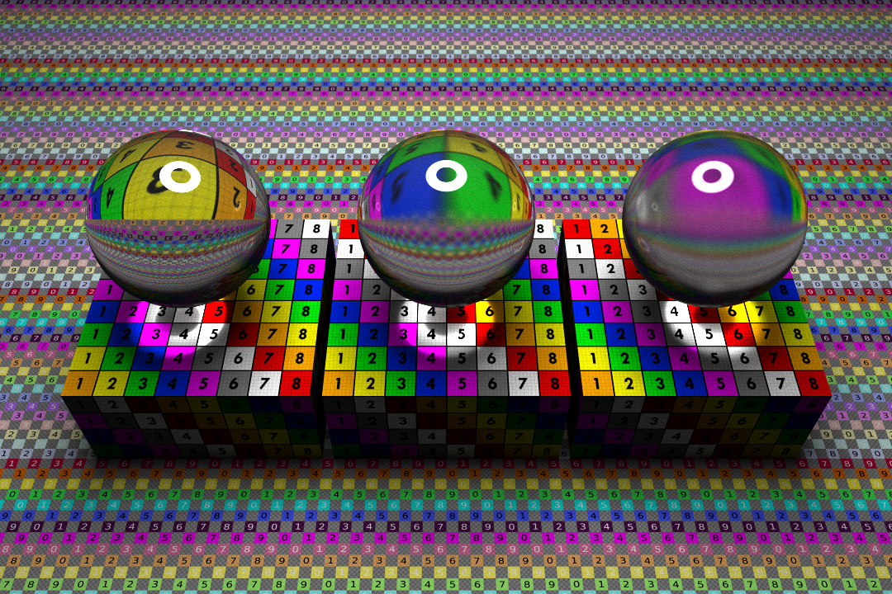

# RT
RT is an advanced rendering project of school 42. It implements Monte-Carlo Path Tracing algorithm, 
uses GPU acceleration via OpenCl and has an ability to set up multicluster renderer through network.  
*Note:* this project was made for MacOS.

  
## Installation
Clone or download this repository and run `make` in command line while in the root of the repository.
This command will build executables called `RT` and `client`.  
  
## Usage
`./RT [filename] [port_number]`  
`filename` must contain path to a valid json file, which describes a scene.  
`port_number` is an optional parameter, when used it sets up server, which listens the given port.  
  
 `./client [server_hostname] [port_number] [-v]`  
 `server_hostname` must be a valid hostname of a machine which runs RT in server mode, 
 enter `localhost` to connect to your own machine.  
 `port_number` must the port which the server (RT) listens.  
 `-v` is an optional parameter, which enables visual mode for client.  
 
 ## Controls
 `WASD, QE` - rotate camera.  
 `Arrows, LSHIFT, SPACE` - move camera.  
 `P` - save picture.  
 `Mousewheel` - vertical to change focal length, horizontal to change aperture size.  
 `LMB` - change `OBJS MENU` focus.  
 
 ## Menus
   
   
 - Menues can be minimized/maximized by clicking on the button at the top right corner of each menu.  
 - Menues can be dragged with mouse.  
 - Clicking on objects in the scene changes `OBJS MENU` focus.  
 - Click `PHOTO ICON` to save rendered picture.  
 - Click `SAVE ICON` to save current scene to `scenes/writing.json`.  
 
 ## More Renders
   
   
   
   
   
   
    
   
 ## Authors
 [vkuksa](https://github.com/VolodymyrKuksa)  
 [ikorchah](https://github.com/ikorchah)  
 [afedun](https://github.com/FedunAnton)  
 [dkushche](https://github.com/dkushche)  
